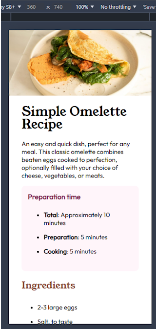

# Frontend Mentor - Recipe page solution

This is my solution to the [Recipe page challenge on Frontend Mentor](https://www.frontendmentor.io/challenges/recipe-page-KiTsR8QQKm). 
Frontend Mentor has challenged me to improve my coding skills by building realistic projects. 

## Table of contents

- [Overview](#overview)
  - [Screenshot](#screenshot)
  - [Links](#links)
- [My process](#my-process)
  - [Built with](#built-with)
  - [What I learned](#what-i-learned)
- [Author](#author)

## Overview

The project is a single, responsive recipe page.

### Screenshot

)

### Links

- Solution URL: https://github.com/FJSolutions/fm-recipe-page
- Live Site URL: https://fjsolutions.github.io/fm-recipe-page/

## My process

### Built with

- Semantic HTML5 markup
- CSS custom properties
- Flexbox
- Mobile-first workflow
- I also tried using [LightningCss](https://lightningcss.dev/) for `css` development
- (Re)used a build script  

### What I learned

I had to use many more styles in my media query than in previous projects. 

## Author

- Frontend Mentor - [Francis Judge](https://www.frontendmentor.io/profile/fjsolutions)
